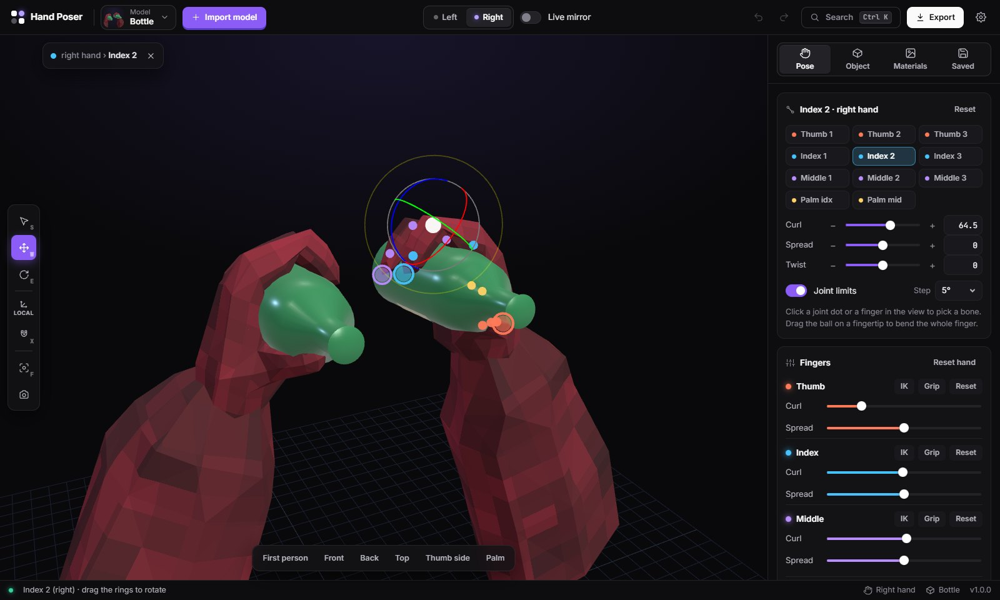
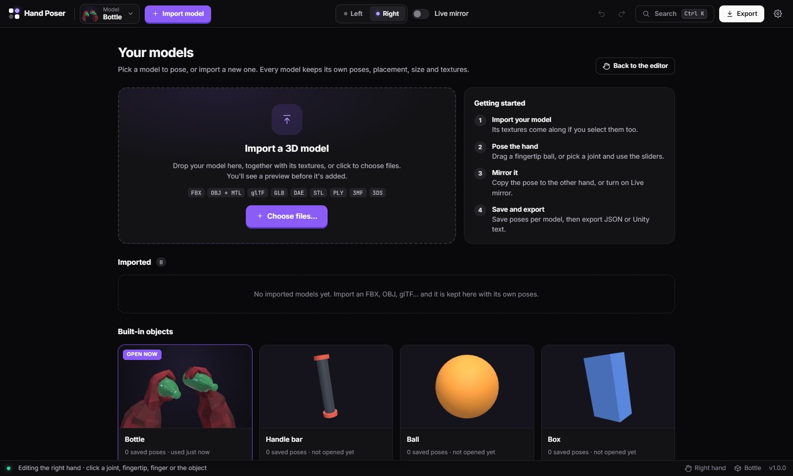

# Hand Poser

Pose a gorilla hand around your own 3D models. You can bend fingers one joint at a time or drag a fingertip and let IK move the whole finger. Mirroring to the other hand is exact. Each model keeps its own poses, textures and placement.



## Download

Get the installer from the **[latest release](https://github.com/stridefr/hand-poser/releases/latest)**:

- **Windows:** `Hand-Poser-Setup-x.y.z.exe`
- **Linux:** `Hand-Poser-x.y.z.AppImage`

The app **updates itself**. It checks GitHub when it starts and every few hours, then downloads new versions in the background. When an update is ready, a pill appears in the title bar. Click it to restart into the new version, or the update installs the next time you close the app.

> The installer isn't code-signed yet, so Windows SmartScreen may say "Windows protected your PC". Click **More info → Run anyway**.

## What it does

- **Your own models:** FBX, OBJ + MTL, glTF / GLB, DAE, STL, PLY, 3MF and 3DS.
  - The import window shows a live preview. It labels each file as the model, a texture or a companion file, and lists any texture the model needs that you haven't added yet.
- **Materials & textures:** every material gets a colour and slots for base colour, normal, roughness, metalness and emissive images.
  - Drop an image on a slot to fill it.
  - Files with the names the model expects are linked automatically.
  - The model's own UVs are used.
- **Pose the hand:**
  - **Per bone:** curl, spread and twist, with sliders, exact numbers, −/+ steps or a rotate gizmo.
  - **Fingertip IK:** drag the ball on a fingertip and the whole finger bends in natural proportions.
  - **Shortcuts:** per-finger curl and spread, presets, and **Auto-grip**, which closes the fingers until they touch the object.
- **Left ⇄ right:** the left hand is an exact reflection of the right, including skeleton, joint axes and the held object, so the thumb and palm always face the right way. You can copy either way, swap, or turn on **Live mirror**.
- **Model library:** the Home screen lists your models. Each one remembers its pose, object placement, size, textures and named saved poses.
- **Export:** pose JSON for both hands, or Unity hand-bone text for the right hand.
- **App features:** Ctrl+K command search, undo/redo, keyboard shortcuts, interface size setting, and screenshots.



## Develop

```bash
npm install
npm start          # builds src/ and opens the desktop app
npm run watch      # rebuild app/app.js on every change (open app/index.html in a browser)
npm run dist       # build the installer locally into release/
```

- **`src/rig.js`:** the skinned hand, its anatomical joint axes and the mirror maths.
- **`src/ik.js`:** fingertip IK (Levenberg-Marquardt with a natural-curl preference) and auto-grip.
- **`src/loaders.js`:** model import.
- **`src/store.js`:** persistence. Settings go to localStorage; models and images go to IndexedDB.
- **`src/main.js`:** the scene, editor, library, import window, materials, settings and updates.
- **`app/`:** the page itself. `app/hand_data.js` holds the hand mesh, skeleton and fur texture.
- **`electron/`:** the desktop shell (window, title bar, auto-updater) and the preload bridge.

## Releasing an update

1. Bump the version with `npm version patch` (or `minor` / `major`). This commits and creates the tag `vX.Y.Z`.
2. Push the commit and the tag: `git push --follow-tags`.

The **Release** workflow then builds the Windows and Linux installers and publishes the GitHub release. Installed apps pick it up automatically.
